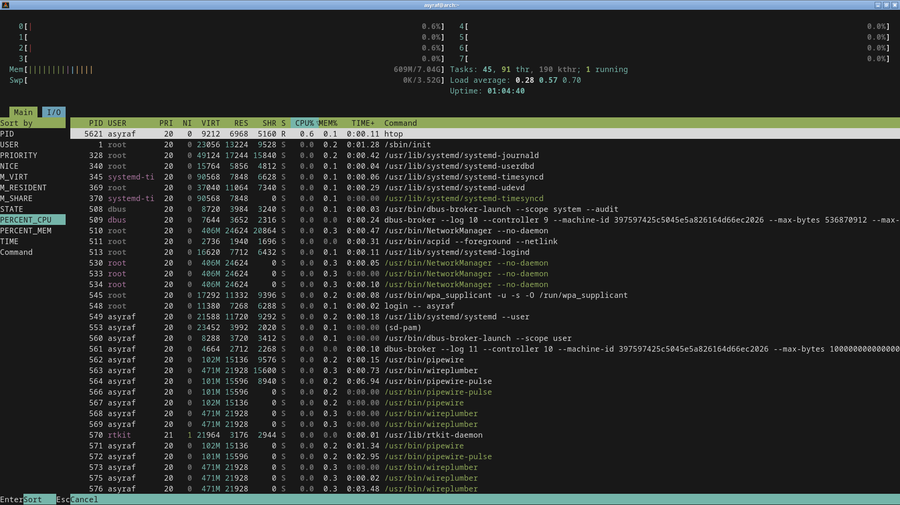

# 💻 Asyraf’s Minimalist Dev-Ops Dotfiles

Welcome to my personal **Arch Linux dotfiles** — a fast, keyboard-driven, and fully minimalist setup built for developers who value control and speed.

If you love the terminal, shortcuts, and zero bloat, this setup is for you.

---

## 🚀 Philosophy

Keep everything **light, fast, and distraction-free**.

- **Keyboard-centric:** 100% controlled via Openbox keybinds and scripts in `~/bin`
- **Zero-bloat:** only essential packages installed
- **Instant:** every app loads in milliseconds

---

## ⚙️ Core Components

| Component | Description |
|------------|--------------|
| **WM:** Openbox | Lightweight and fully customizable window manager |
| **Terminal:** Alacritty | GPU-accelerated and ultra-fast |
| **Shell:** Bash | Clean aliases, functions, and colorized prompt |
| **Scripts:** `~/bin` | Custom CLI tools (Wi-Fi, VPN, system, etc.) |

---

## ⌨️ Key Features

- Fast keyboard navigation  
- Instant app launch with Openbox keybinds  
- Clean dark theme  
- Fully terminal-based workflow  
- Custom scripts for Wi-Fi, VPN, Bluetooth, and MariaDB  
- Auto-symlink installer for quick setup  

---

## 🧰 Custom Commands

| Command | Description |
|----------|--------------|
| `vpn on/off/status` | Manage ProtonVPN (WireGuard) |
| `wifi on/off/connect` | Control Wi-Fi via `nmcli` |
| `bt on/off/connect` | Bluetooth management |
| `mariastart/stop` | Start or stop MariaDB services |
| `update` | System update (`sudo pacman -Syu`) |
| `cleanpkg` | Clean package cache |
| `helpme` | Display all aliases & keybinds |

---

## ⚡ Quick Setup

# 1. Clone the repository
git clone https://github.com/Asyraf2003/dotfiles.git ~/dotfiles

# 2. Install packages
sudo pacman -S --needed - < ~/dotfiles/pkglist_pacman.txt
yay -S --needed - < ~/dotfiles/pkglist_aur.txt

# 3. Create symlinks
ln -s ~/dotfiles/.bashrc ~/.bashrc
ln -s ~/dotfiles/openbox ~/.config/openbox
ln -s ~/dotfiles/alacritty ~/.config/alacritty
ln -s ~/dotfiles/bin ~/bin

# 4. Reboot
systemctl reboot

---

## 📸 Screenshots

🎥 [Watch Live Wallpaper Preview (5 s)](https://github.com/Asyraf2003/dotfiles/raw/main/images/livewall_preview.mp4)

> 🖼️ **Desktop:** Minimalist Openbox environment — no panels, no icons, only a subtle live wallpaper running via `xwinwrap + mpv`.

> 💻 **System Resource:** Idle system using ~300 MB RAM — clean, efficient, and blazing fast.

> ⌨️ **Keybind Overview:** Every system function is bound to a single key — total keyboard control.

---

## 💡 Notes

This setup is built to be:
- Blazing fast ⚡  
- Keyboard-first 🧠  
- Fully scriptable 🔧  

Ideal for developers who live inside the terminal.
